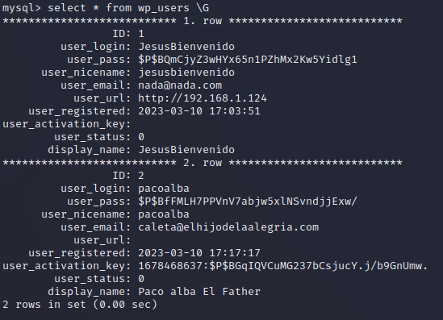

# Guía Hacking

---

### FPING

Primero utilizaremos la herramienta fping para averiguar los hosts que se encuentran en nuestro rango del adaptador de red para averiguar la IP de la máquina a atacar.


| Comando | Argumento | Descripción |
| --- | --- | --- |
| fping | -g | Lista los hosts e indica si están activos y los que no son alcanzables. |
| grep | “alive” | Imprime en pantalla las líneas que coincidan con la expresión indicada. |

---

### PING

Ahora se realizará un ping a la máquina víctima para averiguar que sistema operativo utiliza, podemos observar que el ttl se aproxima a 64, por lo tanto, el sistema operativo es Linux.


| Comando | Descripción |
| --- | --- |
| Ping | Se envía un paquete ICMP para comprobar el estado del Host. |

---

### NMAP

Con nmap realizaremos un escaneo de puertos para averiguar los servicios instalados y los puertos abiertos, como podemos observar, tiene abierto el FTP, el SSH y el HTTP.


| Argumento | Descripción |
| --- | --- |
| -sCV | Utiliza los script que trae Nmap por defecto para detectar las versiones de los servicios encontrados. |
| -p- | Indica que analice los puertos del 1 al 65535. |
| —min-rate | Indica la cantidad de paquetes que se mandan por segundo. |
| -oN | Se utiliza para exportar el resultado a un archivo con formato normal. |

---

### WEB

Una vez tengamos los servicios, entraremos en la página web para  obtener información. Como podemos observar en uno de los comentarios, existe un usuario llamado “JesusBienvenido”.


---

### WPSCAN

Con los servicios hallados anteriormente, podemos observar que utiliza un wordpress 6.1.1, por lo que utilizaremos WPSCAN para realizar un ataque de diccionario al usuario encontrado anteriormente, como podemos observar, el usuario “JesusBienvenido” utiliza la contraseña “tequieromucho”.


---

### WP-admin

Una vez hemos accedido a la pagina WP-admin lo primero que haremos sera buscar información sobre la pagina ya que es posible que wp-scan no haya conseguido listar algún plugin que pueda ser interesante para realizar el ataque.

Lo máximo que alcanzamos a encontrar sospechoso es que actualmente existe otro usuario aparte de JesusBienvenido registrado en WordPress por lo que puede ser un vector de ataque potencial a futuro.


Tras hacer una primera investigación para recopilar información pasamos a intentar ganar acceso a la maquina, la opcion mas factible en este punto es utilizar una reverse-shell. Este tipo de payloads nos permiten como atacante pedirle al servidor que nos mande una Shell interactiva desde el servidor a nuestra maquina atacante dandonos acceso a este con el usuario que ejecuta el servidor Apache.

Usando la Reverse que podemos encontrar en el enlace de pentestmonkey simplemente deberemos de cambiar la dirección y el puerto al cual apunta la reverse, la dirección sera la IP de nuestra maquina atacante y el puerto podemos poner cualquiera ya que posteriormente lo estableceremos en nuestra maquina en escucha. (No pongáis un puerto que ya tengáis ocupado en la maquina atacante)

[pentestmonkey/php-reverse-shell (github.com)](https://github.com/pentestmonkey/php-reverse-shell/blob/master/php-reverse-shell.php)


Una vez hemos establecido nuestro payload ponemos la maquina kali en escucha, esto lo haremos gracias a la utilidad que viene incorporada en nuestra maquina kali llamado nc.

```bash
nc -nvlp "port"
```

---

### MYSQL

Cuando conseguimos acceso a la maquina con wordpress veremos que no tenemos una shell completa esto lo sabremos por que solo vemos el simbolo $ en nuestro prompt.


Esto podemos solucionarlo con los siguientes comandos los cuales permitirá que tengamos una Shell completamente funcional.

```bash
python3 -c 'import pty; pty.spawn("/bin/bash")'
export TERM=xterm
Ctrl + Z
stty raw -echo; fg
```

Si miramos nuestro prompt vemos que hemos ganado acceso como www-data el cual es el usuario por defecto que tiene asignado el servicio web, es por ello que el primer paso seria comprobar si tenemos acceso a este directorio para buscar información sobre la maquina.

Nos situamos en el directorio de wordpress /var/www/wordpress y dentro de este miramos el contenido de wp-config.php, este archivo contiene la información sobre las conexiones que se realizan a la bdd que corre de fondo por lo que si el administrador no ha encriptado la contraseña y esta escrita en claro conseguiremos unas credenciales nuevas.

```php
/ ** Database settings - You can get this info from your web host ** //
/** The name of the database for WordPress */
define( 'DB_NAME', 'wordpress' );

/** Database username */
define( 'DB_USER', 'Subiela' );

/** Database password */
define( 'DB_PASSWORD', 'ElCarli' );

/** Database hostname */
define( 'DB_HOST', 'localhost' );
```

Como hemos visto anteriormente con esta pequeña busqueda hemos conseguido las credenciales del usuario que utilizan para conectarse al servicio de MySQL que corre actualmente en la maquina para hacer funcionar wordpress. 

Si nos conectamos a esta y seleccionamos la Base de datos de wordpress podremos ver los usuarios y contraseñas de los usuarios registrados. Como vemos en la imagen inferior estas se encuentran encriptadas por lo que deberemos de realizar un tratamiento para que podamos usarlas.



---

### JOHNTHERIPPER

Con el usuario y contraseña obtenidas, crearemos un archivo de texto con el usuario y la contraseña utilizando “:” para separarlos, una vez hecho esto le pasaremos el diccionario rockyou.txt con la herramienta john para obtener la contraseña en texto claro.


| Argumento | Descripción |
| --- | --- |
| -w= | Se usa para indiciar el diccionario que se quiere utilizar. |
| —show | Muestra la contraseña por pantalla una vez está crackeada. |

---

### FTP Y SSH

Una vez hemos obtenidos las credenciales de “pacoalba” y su contraseña “hannahmontana” iniciaremos sesión en FTP.


Una vez estemos conectados, navegaremos entre los distintos directorios hasta acceder a la carpeta .ssh, donde tendremos permisos de escritura.


En nuestra máquina de atacante, crearemos un archivo con el nombre “authorized_keys” en la que pondremos nuestra clave pública creada.


| Argumento | Descripción |
| --- | --- |
| -t | Indica el sistema criptográfico a utilizar. |

Una vez este creado el archivo, lo subiremos por FTP a la carpeta .ssh 

.png)

Por último nos conectaremos por el servicio ssh utilizando la clave pública generada y utilizando el usuario “pacoalba” nos conectaremos al servicio.


---

### ESCALADA DE PRIVILEGIOS

Para realizar la escalada de privilegios, primero observaremos los comandos que podemos utilizar con privilegios en el sistema utilizando el comando sudo.


| Argumento | Descripción |
| --- | --- |
| -l | Lista los privilegios del usuario para ejecutar comandos específicos en el sistema. |

Una vez hemos comprobado que podamos utilizar el comando nano con privilegios, utilizaremos los siguiente comandos para realizar la escalada de privilegios para ejecutar comandos como usuario root, utilizando la ejecución de comandos del editor de textos.

```bash
nano
Ctrl+R Ctrl+X
reset; sh 1>&0 2>&0
```

Como podemos observar, hemos podido comprometer la máquina a través de los problemas de configuración y seguridad de los distintos servicios encontrados en el sistema.


